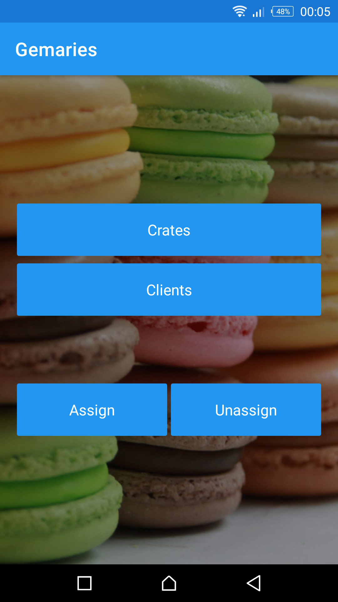
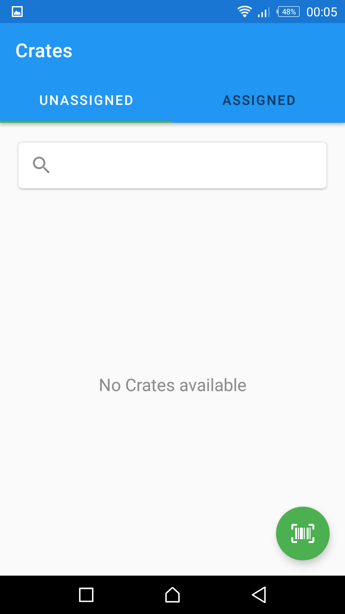
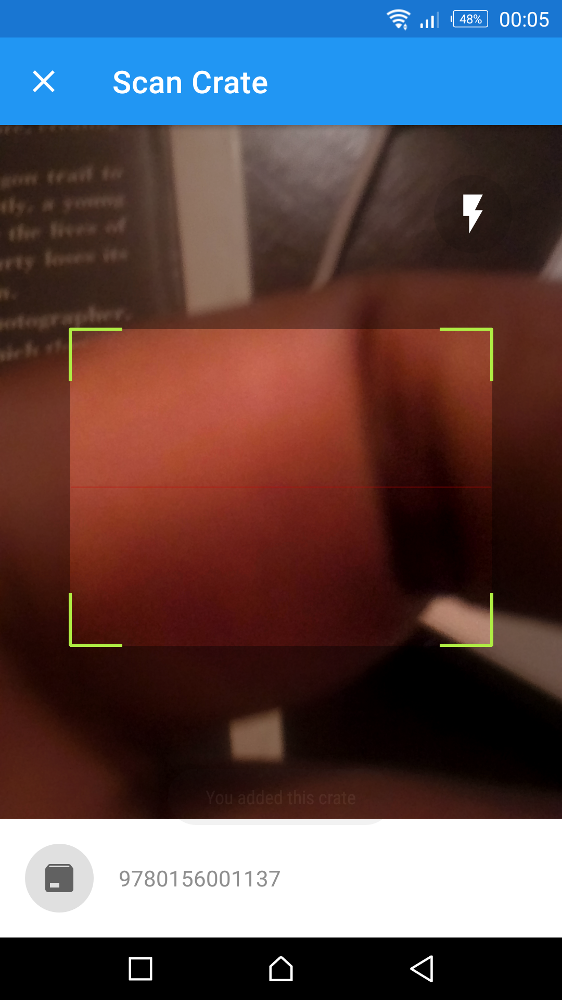
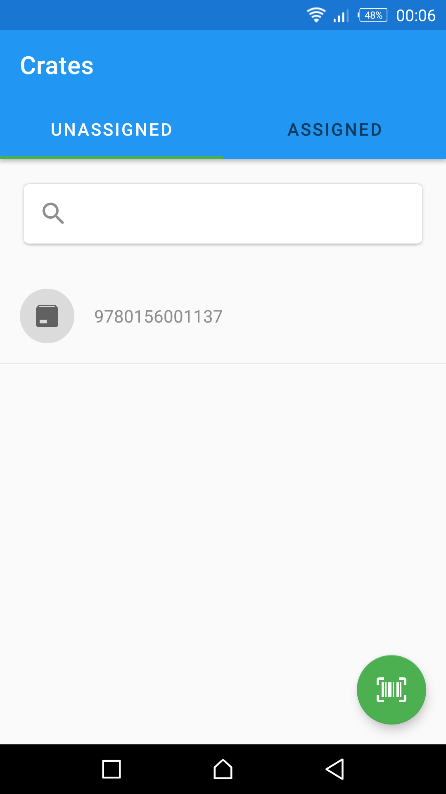
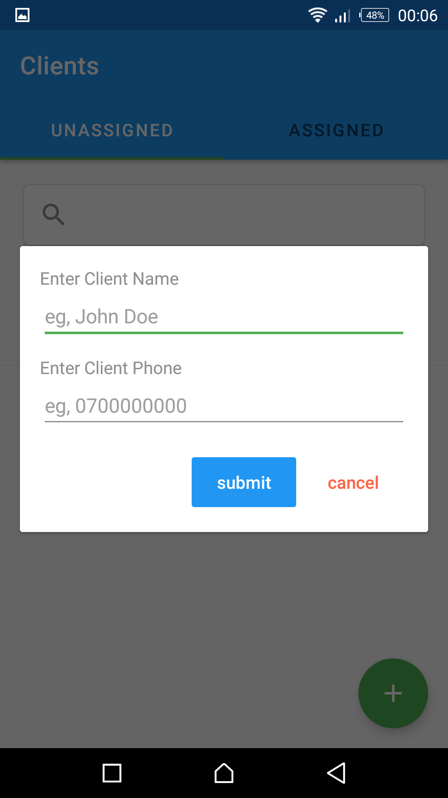
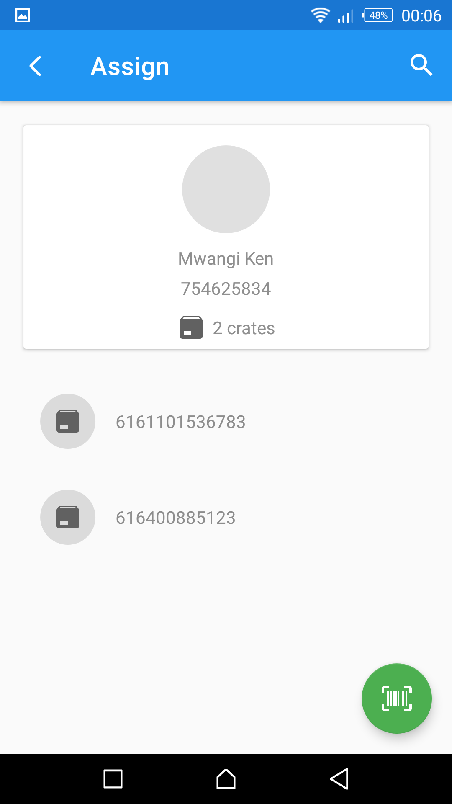

# Gemaries

## Monthly challenges, to create apps to solve meaningful problems for local people.

This app is used to scan bread crates and assigning or un assigning them against a clients local account.

## Objective

- Prevent loss of creates
- Truck the number of crates given

